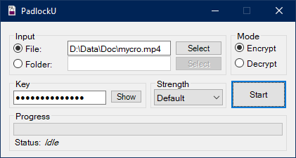

# About 

PadlockU is an encryption application written in C# that uses the AES-256 algorithm.

# License 

PadlockU was created by [UnexomWid](https://uw.exom.dev). It is licensed under the [MIT](https://github.com/UnexomWid/PadlockU/blob/master/LICENSE) license.

# Releases

>Note: versions with the suffix **R** are considered stable releases, while those with the suffix **D** are considered unstable.

[v1.4R](https://github.com/UnexomWid/PadlockU/releases/tag/v1.4R) - January 19, 2019

# Usage

PadlockU lets you choose a key and a level of strength. The higher the level of strength, the more the key is altered.
You **must** use the same key (*case sensitive*) and the same level of strength when decrypting a file, as you used for encrypting that file.
>Note: The 'Default' level is equal to 'Normal'. Therefore, you can encrypt a file with 'Default' strength and decrypt it with 'Normal' strength, and vice-versa, provided you use the same key.
>This will **not** work with any other strength levels.

# Note

If the decrypted files are corrupted, and no errors are shown, that means the file "PadlockU.exe.config" is missing. Make sure *PadlockU.exe* and *PadlockU.exe.config* are in the same folder.

Do *NOT* modify the config.